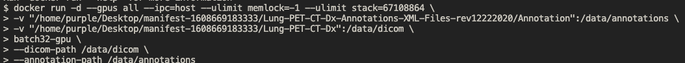

# 3D CNN Lung Tumor Detection 
This tool is meant to preprocess .dicom series and train a 3D convolutional neural network to predict potential tumors given lung CT/PET scans. Data was taken from the Cancer Imaging Archive and is loaded in from a .tcia file with corresponding xml annotations: 
https://www.cancerimagingarchive.net/collection/lung-pet-ct-dx/ 
 

## Usage
This CNN is specifically for preprocessing Cancer Imaging Archive dataset linked above although, with a few modifications, it could possibly work on other similar datasets (folders with dicom images and annotations in a similar structure)  
After cloning the repo you can choose to run it with docker, or run it natively using `nohup`.
### To run with Docker:
1. Build the docker file. Replace `lung-detector-app-v1` with your image name.  
`docker build -t lung-detector-app-v1 .`
2. Run the docker file in detached mode, which will allow you to diconnect from your ssh session if you are using a VM with a more powerful GPU. Example usage:  
`docker run -d -d --gpus all --ipc=host --ulimit memlock=-1 --ulimit stack=67108864 \ nvcr.io/nvidia/tensorflow:24.06-tf2-py3 \    
   -v "/home/purple/Desktop/manifest-1608669183333/Lung-PET-CT-Dx-Annotations-XML-Files-rev12222020/Annotation":/data/annotations \
   -v "/home/purple/Desktop/manifest-1608669183333/Lung-PET-CT-Dx":/data/dicom \
   lung-detector-app-v1 \
   --dicom-path /data/dicom \
   --annotation-path /data/annotations`
    

### To run with nohup:
1. Create a virtual environment and install the requirements (`pip install -r requirements.txt`)
2. Run the command with the location of your .venv environment. Example usage:  
`nohup /home/purple/Desktop/Lung-CT-Prediction/.venv/bin/python main.py \
—dicom-path "/home/purple/Desktop/manifest-1608669183333/Lung-PET-CT-Dx/" \
—annotation-path "/home/purple/Desktop/manifest-1608669183333/Lung-PET-CT-Dx-Annotations-XML-Files-rev12222020/Annotation"`

## Workflow
This repo exists to document the learning experience that resulted from creating a 3D CNN from scratch with zero prior knowledge of designing neural networks and preprocessing medical imaging data. Although the results were not satisfactory, I think the process was worth documenting since I learned a lot along the way, and could apply this knowledge to future applications. The following explains the workflow and pitfalls of this experience. 
 

### 1. Preprocessing
Dataset preprocessing was the biggest challenge, and took the largest amount of time. For every selected series, ensuring the structure can be built in the same direction, the individual slices were sorted either by their z-axis coordinates or, when that information was unavailable, by their Instance Number. This ensured that the reconstructed 3D volumes maintained a consistent anatomical orientation throughout preprocessing. The annotations that defined the bounding boxes of the tumors were provided as XML files, which were named according to SOP Instance ID, and not every slice had a corresponding annotation file. Each CT series was matched to its corresponding annotation using shared metadata identifiers. After pairing them, a dataset-mapping structure was created so that every slice was linked to its appropriate label information. This mapping later served as the basis for generating the structured input needed for both preprocessing and model training. Each CT series was converted into a standardized 3D tensor through several preprocessing steps. First, image intensities were normalized to reduce variations across scans. The volumes were then resampled and resized to a fixed resolution of 64 × 64 × 64 voxels. At the same time, label maps, either segmentation masks or class labels, were generated to correspond to each processed volume. Series that could not be reliably processed due to missing or inconsistent information were excluded to maintain dataset quality.

### 2. Training the model
While mounting the GPUs in the VM we were using to our Docker containers, we ran into dependency issues, since the base image we were using (nvcr.io/nvidia/tensorflow:24.06-tf2-py3) was newer and incompatible with a version of Numpy that other dependencies were using. After much experimentation with different base images and even multi-stage Docker builds, we found out that we could afford to remove the most incompatible dependency and pin an older Numpy image to the container so that everything else was synchronized. We also reduced the target shape from 128 × 128 × 128 to 64 × 64 × 64 and reduced the batch size from 64 to 16 in an attempt to save computational power. Unfortunately, though, the CUDA kernel crashed in the middle of training (Epoch 3/15). We hypothesized that it could be because of XLA compilation of TensorFlow, which is known to have issues with certain combinations of CUDA and conv3D-related patterns.  
We then tested with a smaller input and batch size to test out. However, the model had 100% accuracy. At first we thought that because we were testing on a small subset of patients in the data, which we were reading in sequentially, the patients with the same types of carcinomas were read in a row, e.g. the first 128 patients had large cell carcinoma, the next 72 had small cell carcinoma, etc. After increasing the training size and getting the same result though, we added some sanity checks and found that there was a label generation error in which all the labels were the same.
